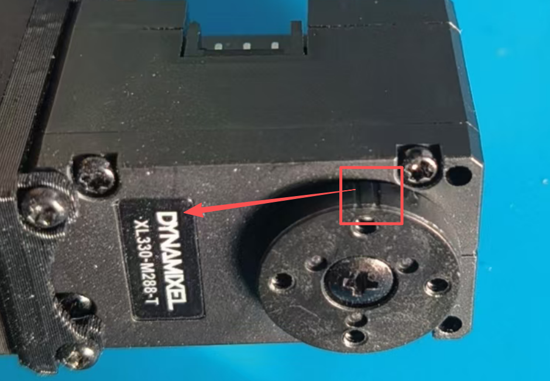
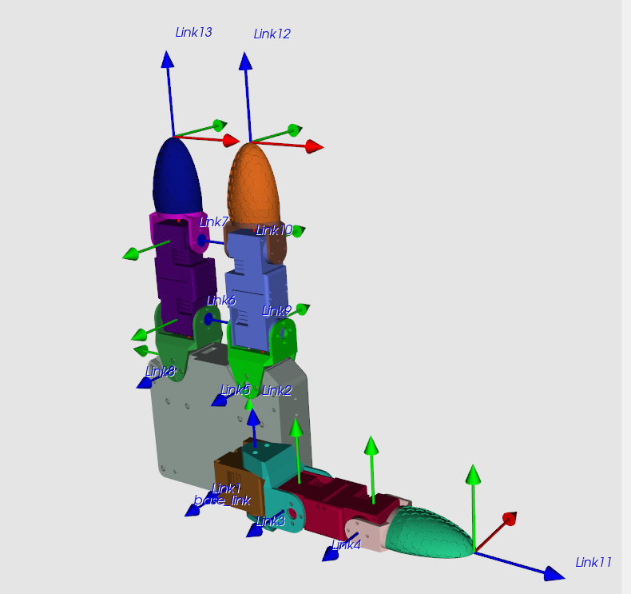
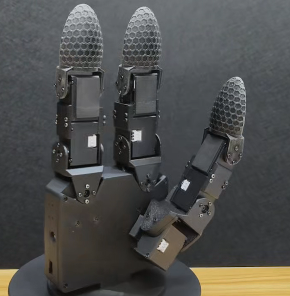
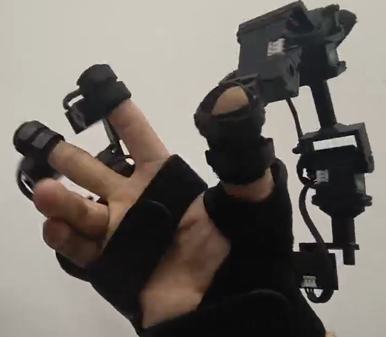

## Libgex2

### Main Updates

#### No Need to Set Zero

No need to set zero of the motors. The zero position of the GX10 or EX12 should be installed as following (The red rectangle should be aligned with the 'D'):

In this way, when the GX10 or EX12 is in machanical zero positions, all the motors should have 90 degree position reading from the sensor.

#### GX10

GX10 is a brand new tri-finger 10 DoF dexterous hand (zero positions viewed by [URDFly](https://github.com/Democratizing-Dexterous/URDFly)):

GX10 has the same size of human and and optimized wiring (nearly no wire exposed).

#### EX12

EX12 is a brand new tri-finger 12 DoF exoskeleton glove (zero positions viewed by [URDFly](https://github.com/Democratizing-Dexterous/URDFly)):

EX12 is fully optimized for wearable purpose (customized finger tip and wearable glove).
