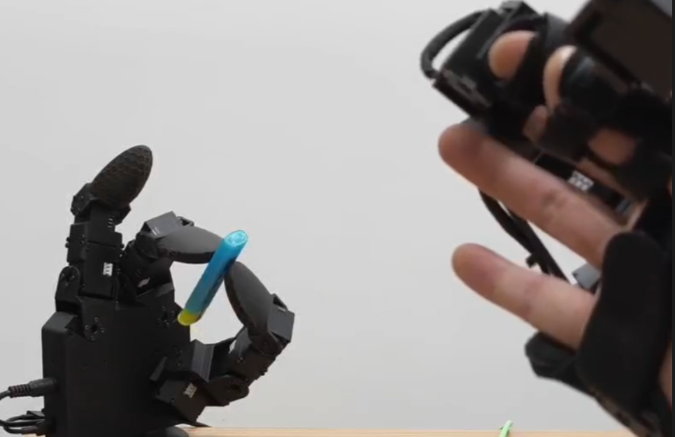

## Libgex2

Python library for GX10 and EX12.
### Usage

Basic requirements: x64 Ubuntu 22.04 and Python (>=3.8).

Python requirements:

```
pip install pyserial
pip install pybullet
pip install numpy
```

Add the current user to the `dialout` group so that it can access the serial devices (no need to `chmod 777 /dev/ttyUSB* or /dev/ttyACM*`):

OpenRB150 will be recognized as `/dev/ttyACM*` (usually `/dev/ttyACM0`). U2D2 will be recognized as `/dev/ttyUSB*` (usually `/dev/ttyUSB0`).

```bash
sudo usermod -a -G dialout $USER
```

Change the latency timer of the GX10 U2D2 to `1` (default is `16`), otherwise the latency will be `16` ms:

```bash
echo 1 | sudo tee /sys/bus/usb-serial/devices/ttyUSB0/latency_timer
```

or changing all `ttyUSB*` by:
```bash
for dev in /sys/bus/usb-serial/devices/ttyUSB*/latency_timer; do
    echo 1 | sudo tee "$dev"
done
```

#### GX10

Connect 5V DC power and usb to the GX10, the device will be recognized as `/dev/ttyUSB*` (usually `/dev/ttyUSB0`), you can control the GX10 by: 

```python
import sys
sys.path.append('<path_to_libgex2>') # replace with the actual path to libgex2

from libgex2 import Hand
import numpy as np


hand = Hand("/dev/ttyUSB0")  # or using serial_number='XXXX'
hand.connect(curr_limit=1000, goal_current=600, goal_pwm=200)

hand.home() # move to home position
print(hand.getjs()) # get joint positions, unit: degree

hand.setjs([0]*10) # equal to hand.home()

hand.setj(10, 60) # set joint 10 (starting from 1) to 60 degree
```

The joint order of the GX10 is:

```
1: thumb 1 (bottom)
2: thumb 2
3: thumb 3
4: thumb 4 (tip)
5: index 1 (bottom)
6: index 2
7: index 3 (tip)
8: middle 1 (bottom)
9: middle 2
10: middle 3 (tip)
```


### EX12
Connect type-c USB to EX12, the device will be recognized as `/dev/ttyACM*` (usually `/dev/ttyACM0`), you can control the EX12 by:

```python
import sys
sys.path.append('<path_to_libgex2>') # replace with the actual path to libgex2

from libgex2 import Glove
import numpy as np


glove = Glove("/dev/ttyUSB0", left=False)  # or using serial_number='XXXX', left=True for left hand
glove.connect()

print(glove.getjs()) # get joint positions, unit: degree

thumb_tip_xyz, index_tip_xyz, mid_tip_xyz = glove.fk() # get finger XYZ coordinates, unit: m
```

The joint order of the EX12 is:

```
1: thumb 1 (bottom)
2: thumb 2
3: thumb 3
4: thumb 4 (tip)
5: index 1 (bottom)
6: index 2
7: index 3 
8: index 4 (tip)
9: middle 1 (bottom)
10: middle 2 
11: middle 3 
12: middle 4 (tip)
```

Detail of the API can be found [here (Chinese)](libgex/api.md).

### Retargeting from EX12 to GX10 (Dexterous Teleoperation)

The retargeting code is in [gex_retargeting_sim](https://github.com/Democratizing-Dexterous/gex_retargeting_sim). Put folder `gex_retargeting_sim` in the same directory level as `libgex2`.

```python
import sys
sys.path.append('<path_to_libgex2>') # replace with the actual path to libgex2, gex_retargeting_sim is in the same directory level as libgex2


import numpy as np
import time

from libgex import Hand, Glove
from gex_retargeting_sim import GexRetarget

gex_retarget = GexRetarget()


hand = Hand(port="/dev/ttyUSB0")  
hand.connect()


glove = Glove(port="/dev/ttyACM0") 
glove.connect()

print("start retargeting...")

while True:

    glove_base_pose = np.array([0, 0, 0])

    glove_finger1_pos, glove_finger2_pos, glove_finger3_pos = glove.fk()

    glove_fingers_pos = np.concatenate(
        [
            glove_base_pose[None, :],
            glove_finger1_pos[None, :],
            glove_finger2_pos[None, :],
            glove_finger3_pos[None, :],
        ],
        axis=0,
    )

    qpos = gex_retarget.retarget(glove_fingers_pos)

    qpos_degree = qpos * 180 / np.pi

    hand.setjs(qpos_degree)
```

By running the code above, you can move the glove to control the dexterous hand as following:




### Main Updates

#### No Need to Set Zero

No need to set zero of the motors. The zero position of the GX10 or EX12 should be installed as following (The red rectangle should be aligned with the 'D'):


In this way, when the GX10 or EX12 is in machanical zero positions, all the motors should have 90 degree position reading from the sensor.

#### GX10

GX10 is a brand new tri-finger 10 DoF dexterous hand (zero positions viewed by [URDFly](https://github.com/Democratizing-Dexterous/URDFly)):


GX10 has the same size of human and and optimized wiring (nearly no wire exposed).

The urdf file of GX10 is [here](libgex/gx10/urdf/gx10.urdf).

#### EX12

EX12 is a brand new tri-finger 12 DoF exoskeleton glove (zero positions viewed by [URDFly](https://github.com/Democratizing-Dexterous/URDFly)):


EX12 is fully optimized for wearable purpose (customized finger tip and wearable glove).

The urdf file of EX12 is [here](libgex/ex12/urdf/ex12.urdf).
